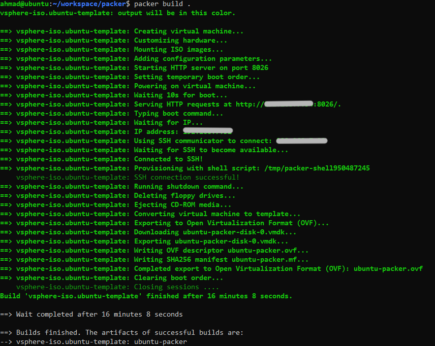
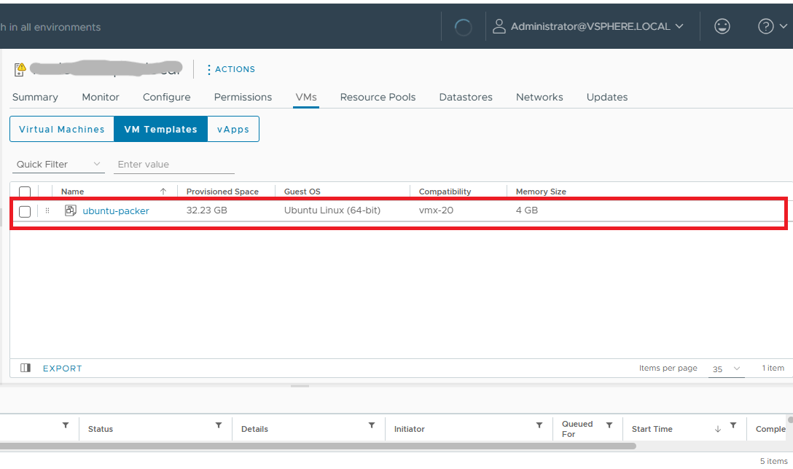

## Introduction
Creating consistent, repeatable virtual machine (VM) templates is a key part of modern DevOps and Infrastructure as Code (IaC) practices. **HashiCorp Packer** simplifies and automates this process. In this tutorial, you'll learn how to use Packer to build an Ubuntu 24.04 VM template on VMware vSphere using the [`vsphere-iso`](https://developer.hashicorp.com/packer/integrations/hashicorp/vsphere/latest/components/builder/vsphere-iso) builder plugin.

You’ll automate the following tasks:
- Connect to a **vCenter server**
- Boot and install **Ubuntu 24.04 via ISO** and **cloud-init**
- Provision the VM with custom configurations
- Convert the VM to a reusable **vSphere template**

👉 View the full project on GitHub: [**GitHub Repository**](https://github.com/ahmadpiran/packer-vsphere-ubuntu2404)

Let’s dive in and explore how this works step-by-step.

## Why Use Packer?
Packer automates the creation of machine images across platforms. When used with vSphere, you can automate the process of creating VM templates, reducing manual errors and ensuring consistency across environments. This is especially useful for teams using **Infrastructure as Code (IaC)** and **immutable infrastructure** practices.

## Embracing Immutable Infrastructure with Packer
One of the key benefits of using Packer is that it encourages the principle of [**immutable infrastructure**](https://www.hashicorp.com/en/resources/what-is-mutable-vs-immutable-infrastructure) — a modern approach where servers are never modified after they're deployed. Instead of patching or reconfiguring a running system, you simply replace it with a new version.
Here’s why this matters:

- ✅ **Consistency**: Every VM or server you spin up from a Packer-built template is exactly the same. No more “it works on my machine” scenarios or unpredictable differences between environments.

- 🔁 **Reproducibility**: Since Packer templates are code, you can version them in Git. This makes it easy to roll back to a known-good state or audit what changed between builds.

- 🔐 **Reliability**: Eliminating manual configuration or drift leads to fewer errors in production. You always know exactly what is running.

- ⚡ **Speed**: Instead of applying updates to live systems, you build a new image with changes baked in. This enables [blue-green deployments](https://docs.aws.amazon.com/whitepapers/latest/blue-green-deployments/introduction.html), fast rollbacks, and smoother scaling.

In our Packer example, once the VM is built and provisioned, it’s converted to a template in vSphere:

```hcl
convert_to_template = true
```

This template can then be used to create new VMs, ensuring every instance is consistent and aligned with your intended configuration. If you need updates, just modify the Packer file, rebuild the image, and redeploy — no patching, no surprises.
Immutability is a cornerstone of infrastructure-as-code and modern DevOps practices, and Packer is a great tool to help you get there.

## 📁 Project Directory Structure
the structure of this project looks like this:
```kotlin
/
├── ubuntu-template.pkr.hcl
├── variables.pkr.hcl
├── http/
│   ├── meta-data
│   └── user-data
└── output-artifacts/
```

> ⚠️ Note: You must use a **vCenter-managed ESXi host**. Standalone ESXi is not supported for this setup.

## ⚙️ Main Packer Configuration (ubuntu-template.pkr.hcl)
We write our main configurations in the `ubuntu-template.pkr.hcl` file using the vSphere plugin. This plugin supports three types of builders:

- 🧱 `vsphere-iso` – Builds a VM image from an **ISO file** using the vSphere API (used in this project).
- 📦 `vsphere-clone` – Clones a VM from an existing **template** and customizes it.
- ☁️ `vsphere-supervisor` – Deploys a VM to a **vSphere Supervisor cluster** using the VM Service (used in Kubernetes-integrated vSphere).

> ✅ In this tutorial, we’re using the vsphere-iso builder because we want to build a brand-new Ubuntu 24.04 template from an ISO file and convert it into a reusable vSphere template.

### 🔧 vSphere Connection Settings
Start by adding the required plugin block:

```hcl
packer {
  required_plugins {
    vsphere = {
      version = "~> 1"
      source  = "github.com/hashicorp/vsphere"
    }
  }
}
```
Initialize the plugin:

```bash
packer init .
```

We are going to define the image build source. 

```hcl
# ubuntu-template.pkr.hcl
source "vsphere-iso" "ubuntu-template" {
  ...
}
```

### 🌐 vCenter Connection Settings
Here, we specify how to connect to vCenter. Setting `insecure_connection = true` allows skipping TLS verification — useful in lab environments but not recommended in production.

```hcl
vcenter_server      = var.vcenter_server_address
username            = var.vcenter_username
password            = var.vcneter_password
insecure_connection = true
```

Declare variables in `variables.pkr.hcl`:

```hcl
variable "vcenter_server_address" {
  type = string
  default = "<server_address>"
  sensitive = true
}

# Similar for username and password...
```

### 🏗️ VM Build Target (Host, Datacenter, Datastore)

```
# ubuntu-template.pkr.hcl
host        = var.host_address
datacenter  = var.datacenter
datastore   = var.datastore
```

And declare the variables:

```hcl
# variables.pkr.hcl
variable "host_address" {
  type = string
  default = "<host_address>"
  sensitive = true
}
variable "datacenter" {
  type = string
  default = "<datacenter_name>"
}
variable "datastore" {
  type = string
  default = "<datastore_name>"
}
```

### 🖥️ VM Hardware Configuration
Basic VM specs are defined here. Setting `convert_to_template = true` ensures that the resulting VM is automatically turned into a reusable vSphere template.

```hcl
# ubuntu-template.pkr.hcl
vm_name              = "ubuntu-packer"
guest_os_type        = "ubuntu64Guest"
CPUs                 = 2
RAM                  = 4096
RAM_reserve_all      = true
disk_controller_type = ["pvscsi"]
convert_to_template  = true
```

### 💽 Disk and Storage
This block specifies a 32GB thin-provisioned disk. Thin provisioning saves storage space by allocating space dynamically.

```hcl
storage {
  disk_size             = 32768
  disk_thin_provisioned = true
}
```

### 🌐 Networking
We assign a `vmxnet3` network adapter and bind it to the vSphere network named "`VM Network`". Be sure to replace this with the actual network name in your vSphere setup.

```hcl
network_adapters {
  network_card = "vmxnet3"
  network      = "VM Network"
}
```

### 📀 Booting From ISO
This tells Packer where to find the ISO file used to install Ubuntu.

```hcl
iso_paths = ["[${var.datastore}] repo/ubuntu-24.04.1-live-server-amd64.iso"]
```

### 🌩️ Cloud-Init Over HTTP
This creates a temporary HTTP server to serve cloud-init files from the local http directory. These files will automate the Ubuntu installation process.

```hcl
http_directory = "./http"
http_port_min  = 8000
http_port_max  = 8050
```

**meta-data** (can be empty for now):
```yaml
# ./http/meta-date

```

**user-data** for auto-installation:
```yaml
# ./http/user-data
#cloud-config
autoinstall:
  version: 1
  locale: en_US
  keyboard:
    layout: us
  ssh:
    install-server: true
    allow-pw: true
  packages:
    - openssh-server
  user-data:
    password: ubuntu
    chpasswd:
      expire: False
```
You can customeise this configuration based on your needs.

### ⌨️ Boot Command (Autoinstall)
This command uses Ubuntu’s autoinstall feature to initiate a fully automated OS installation using cloud-init served via HTTP.

```hcl
boot_command = [
  "<esc><wait>",
  "c<wait>",
  "linux /casper/vmlinuz --- autoinstall ds=\"nocloud-net;seedfrom=http://{{ .HTTPIP }}:{{ .HTTPPort }}/\"<enter><wait>",
  "initrd /casper/initrd<enter><wait>",
  "boot<enter><wait>"
]
```

### 🔐 SSH Access Configuration
Packer waits for the machine to become reachable over SSH so it can continue provisioning. These values give the system enough time to finish the OS install.

```hcl
ssh_username           = "ubuntu"
ssh_password           = "ubuntu"
ssh_port               = 22
ssh_timeout            = "60m"
ssh_handshake_attempts = "100"
```

### 📴 Shutdown Procedure
Once provisioning is done, this command gracefully shuts down the system.

```hcl
shutdown_command = "echo 'ubuntu' | sudo -S shutdown -P now"
```
### 🔧 Provisioning the VM
After the OS is installed and SSH is available, this simple shell provisioner verifies the connection and install nginx. you can change the provisioner codes based on your needs.

```hcl
build {
  sources = ["source.vsphere-iso.ubuntu-template"]

  provisioner "shell" {
    inline = [
      "echo 'SSH connection successful!'",
      "sudo apt update",
      "sudo apt install nginx -y",
      "sudo systemctl enable nginx",
      "sudo ufw allow proto tcp from any to any port 22,80,443",
      "echo 'y' | sudo ufw enable"
    ]
  }
}
```

## 🚀 Build and Export the Template
To run the build, you would typically execute:

```bash
packer fmt .
packer validate .
packer build .
```
Make sure your http/ directory contains the appropriate cloud-init files, and your ISO path and vSphere credentials are correctly set.


This is how looks like in the Terminal.



This will build the template and save it on the host. and then you can use it to deploy as many times as you want.



If you want to create the OVF version of your image you can add the following to the `source` block:

```hcl
export {
    force            = true
    output_directory = "./output-artifacts"
  }
``` 

This will create ovf as well as vmdk file in the specified directory.

## ✅ Conclusion
By automating Ubuntu 24.04 template creation on VMware vSphere with **HashiCorp Packer**, you ensure consistent, fast, and error-free VM deployments. This approach aligns perfectly with **immutable infrastructure** and **DevOps best practices**, making your infrastructure more reliable and maintainable.

Whether you're managing a small homelab or scaling enterprise workloads, Packer gives you full control over your VM lifecycle — from image creation to deployment.